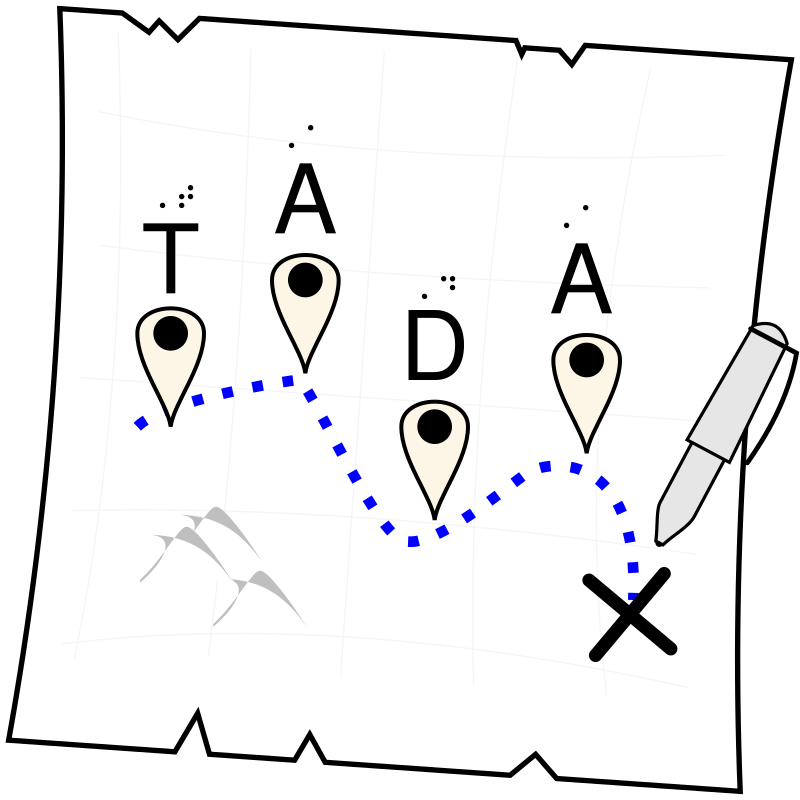

## TADA!

TADA! is an acronym for Tactile Art and Design Adventures, and designed to be a free online curriculum for anyone to use with a student of any age and ability who would like to learn nonvisual basic drawing skills, spatial concepts related to coding, and how to create computer graphics. TADA offers a set of ten (10) activities that are organized as introductory, intermediate, and advanced "points of interest" that can be followed like an adventure map and punctuated with excitement!

 

---

By following the TADA! map, students can expect to:

- Learn to draw using physical media and materials
- Exercise spatial literacy with physical and virtual canvases
- Learn basic coding concepts
- Practice using accessible descriptive language
- Develop basic concepts for creating computer graphics
- Apply creativity and resilience towards drafting, rendering, and revision processes

## How to Use TADA!

Any individual of any age and ability who may consider themself a student of art and design can benefit from this adventure map. Teachers may use this broadly as a curriculum with students of any age and skill level, with an emphasis on participation to any extent that is meaningful to the student. No aided perfection, please! We encourage all students to create to their heart's desire, and for teachers to embrace all efforts in the spirit of participation.

Although we present a set of ten activities with suggested materials and resources, we encourage adaptations to:

- All activities
- Each step of every activity
- (and especially) Any and all materials, tools, and resources so that all students may have an equitable opportunity to engage with TADA!

Remember: Art and design is for everyone!

## Acknowledgments

TADA! is meant to be a living resource, open to revision and updates in response to community needs. The project draws upon the lived and learned experiences of the CATT-NW team:

- Yue-Ting (Ting) Siu, TVI/O&M, Ph.D — CATT-NW Coordinator
- Leslie Edmonds, TVI — CATT-NW Tech Trainer
- Marco Salsiccia — Blind Designer and Accessibility Specialist
- Lee Chandler — WA Statewide STEM/AT Consultant
- Danielle Montour — CATT-NW Technical Consultant

We also acknowledge the expertise of many, many others who are artists, creators, and changemakers in this space. TADA! aims to shed light on the work across communities by creating an initial resource that can be shared freely and updated frequently. Resources listed in TADA! are meant to be a starting point, with the understanding that there are many more experts and resources available that are not listed. We do not claim to be experts in the topic of tactile media and literacy; our hope is to build community, promote excitement about accessible drawing and design, and help advocate for equitable access to the arts to support justice-oriented education practices.

The Northwest Center for Assistive Technology Training (CATT-NW) is based at the Washington State School for the Blind (WSSB) and part of the national CATT program. CATT was founded in 2019 at the Alabama Institute for the Blind (AIDB) and powered via collaboration with the American Printing House for the Blind (APH).

**Next:** [Foreword](02_FOREWORD.md)(WSSB) and part of the national CATT program. CATT was founded in 2019 at the Alabama Institute for the Blind (AIDB) and powered via collaboration with the American Printing House for the Blind (APH).

---

---

---

---

  
  &nbsp;&nbsp;
  <a href="https://www.wssb.wa.gov/services/northwest-center-assistive-technology-training-catt-nw">Northwest Center for Assistive Technology...</a> - <a href="https://www.wssb.wa.gov/">Washington State School for the Blind</a>
  &nbsp;&nbsp;
  

